<div align="center">


<br/>

<a href="https://linkedin.com/in/claudia-lopez-bombin"></a>
<a href="https://x.com/@claudialbzz"></a>
<a href="mailto:claudialbombin@gmail.com"></a>
<a href="https://instagram.com/@claudialbzz"></a>

</div>

<br/>

## 💫 About Me

I'm a second-year **Mathematical Engineering & Artificial Intelligence** student at **ICAI, Universidad Pontificia Comillas**, and a **42 Madrid (Fundación Telefónica) Cursus** student on the side. Most of what lives in my repositories comes back to the same idea: **turning uncertainty into a number I can act on** — Monte Carlo option pricing, an F1 pit-stop strategy solved as a Markov Decision Process, particle filters for stochastic volatility, and a Hi-Lo blackjack solver, alongside my ICAI coursework and 42's C curriculum.

I also compete in academic and parliamentary debate (British Parliamentary format), which is where the habit of stress-testing an argument before trusting it comes from — the same instinct I apply to a model before trusting its output.

```txt
class Claudia:
    def __init__(self):
        self.role        = "iMAT student @ ICAI + 42 Madrid Cursus"
        self.builds_with  = ["Python", "C", "stochastic simulation"]
        self.currently    = "F1 pit-stop optimization (MDP) · options pricing engine"
        self.also_does    = "British Parliamentary debate"
```

<details>
<summary><b>🔭 quick facts</b> (click to expand)</summary>
<br/>
<ul>
<li>🎓 iMAT program (Mathematical Engineering &amp; AI) — ICAI, Comillas — year 2</li>
<li>🖥️ 42 Madrid Fundación Telefónica — Cursus (C, algorithms, systems)</li>
<li>🔭 Currently building <strong><a href="https://github.com/claudialbombin/pitwall">pitwall</a></strong>, a stochastic F1 pit-stop optimizer, and a dual Python/C <strong><a href="https://github.com/claudialbombin/monte-carlo-option-pricer">options pricing engine</a></strong></li>
<li>🤝 Open to collaborating on open-source simulation/ML tooling and data engineering projects</li>
<li>💬 Ask me about Monte Carlo methods, Python↔C performance trade-offs, or debate case construction</li>
<li>⚡ Fun fact: constructing a debate case and debugging a model are the same exercise — both mean tracing a conclusion back to the premise that's actually wrong</li>
</ul>
</details>

<br/>

## 🚀 Featured Projects

<table>
<tr>
<td width="50%" valign="top">
<h3>🏎️ <a href="https://github.com/claudialbombin/pitwall">pitwall</a></h3>
<p>Stochastic <strong>F1 pit-stop strategy optimizer</strong>: a Markov Decision Process solved over tyre-degradation and safety-car models, calibrated with Gaussian Process Regression and Bayesian inference, backtested against real race data via Monte Carlo simulation — with an interactive web simulator to explore the resulting strategy.</p>
<p><code>Python</code> <code>MDP</code> <code>Bayesian inference</code> <code>Monte Carlo</code></p>
</td>
<td width="50%" valign="top">
<h3>📈 <a href="https://github.com/claudialbombin/monte-carlo-option-pricer">monte-carlo-option-pricer</a></h3>
<p>Option pricing engine covering <strong>European, Asian and barrier options</strong> under Black-Scholes and Heston stochastic volatility, with Greeks computed four ways (pathwise, likelihood-ratio, finite-difference, closed-form). Parallel Python and C implementations, 77 unit tests.</p>
<p><code>Python</code> <code>C</code> <code>Quant finance</code></p>
</td>
</tr>
<tr>
<td width="50%" valign="top">
<h3>🃏 <a href="https://github.com/claudialbombin/beat-the-dealer">beat-the-dealer</a></h3>
<p>Blackjack solved two ways: Monte Carlo simulation derives optimal basic strategy, then a <strong>Hi-Lo card-counting</strong> layer shows the edge it buys — expected value rising roughly linearly with the true count. Dual Python/C implementation, the C version written under 42-style constraints (no dynamic memory, ≤25 lines per function).</p>
<p><code>Python</code> <code>C</code> <code>Monte Carlo</code></p>
</td>
<td width="50%" valign="top">
<h3>🎲 <a href="https://github.com/claudialbombin/scm-heston-filter">scm-heston-filter</a></h3>
<p>A <strong>particle filter</strong> (Sequential Monte Carlo) that tracks the unobserved volatility state of the Heston model from noisy price observations alone — the estimation half of the same stochastic-volatility problem <code>monte-carlo-option-pricer</code> prices.</p>
<p><code>Python</code> <code>Sequential Monte Carlo</code></p>
</td>
</tr>
<tr>
<td width="50%" valign="top">
<h3>🫁 <a href="https://github.com/claudialbombin/pause">pause</a></h3>
<p>An installable <strong>PWA</strong> that puts a short breathing exercise between you and Instagram/TikTok/YouTube (or any app you name) — friction instead of a hard block, aimed at breaking the autopilot open-and-scroll habit.</p>
<p><code>JavaScript</code> <code>PWA</code> <code>Wellbeing</code></p>
</td>
<td width="50%" valign="top">
<h3>🀄 <a href="https://github.com/claudialbombin/mus-stochastic-suite">mus-stochastic-suite</a> <sub>· early stage</sub></h3>
<p>Planned: an interactive <strong>Mus</strong> (Spanish card game) suite — local multiplayer, bots at adjustable difficulty, a beginner tutorial, and dual Python/C engines that simulate thousands of games to model optimal strategy.</p>
<p><code>Python</code> <code>C</code> <code>Game theory</code></p>
</td>
</tr>
</table>

<div align="center">
<sub>Coursework & systems programming: <a href="https://github.com/claudialbombin/2imat"><b>2imat</b></a> — ICAI year-2 hub (data acquisition, ML, SQL/MongoDB) · 42 Madrid Cursus exercises in C: <a href="https://github.com/claudialbombin/BSQ">BSQ</a>, <a href="https://github.com/claudialbombin/push_swap">push_swap</a>, <a href="https://github.com/claudialbombin/42">42</a></sub>
</div>

<br/>

## 💻 Tech Stack

### 🤖 AI/ML & Data Science


### 💾 Databases


### ⚡ Performance & Systems


### 🎨 Design & Tools


### 📝 Automation


<br/>

## 📊 GitHub Analytics

<div align="center">


<br/><br/>



</div>

<sub>Both cards above are plain SVG files that live in this repo (`assets/`) — nothing is fetched from a third-party server, so they always render. They're kept current automatically by <a href="./.github/workflows/update-stats.yml">a weekly GitHub Action</a> that pulls real numbers from the GitHub API and re-commits the SVGs.</sub>

<details>
<summary>🐍 Contribution snake (optional, one-time setup)</summary>
<br/>

This repo also ships <a href="./.github/workflows/snake.yml">a workflow</a> that turns your real contribution graph into an animated snake. It needs to run once before the image exists — it's not enabled by default:
<ol>
<li>Push this repo (with the <code>.github/workflows/snake.yml</code> file) to GitHub.</li>
<li>Go to the <strong>Actions</strong> tab → select <strong>"Generate Snake animation"</strong> → <strong>Run workflow</strong>.</li>
<li>Wait ~1 minute — it creates an <code>output</code> branch with the generated SVGs.</li>
<li>Then add this to the README, wherever you'd like it:</li>
</ol>

```md
<picture>
  <source media="(prefers-color-scheme: dark)" srcset="https://raw.githubusercontent.com/claudialbombin/claudialbombin/output/github-contribution-grid-snake-dark.svg" />
  
</picture>
```

It re-runs nightly after that, so it stays in sync with your real activity.

</details>

<br/>

---

<div align="center">
<sub>⭐ Feel free to explore my repositories and reach out for collaboration — details above.</sub>
</div>
